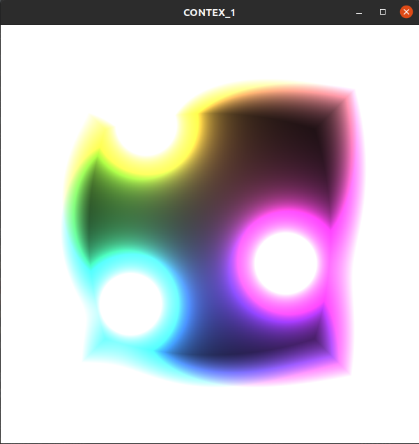
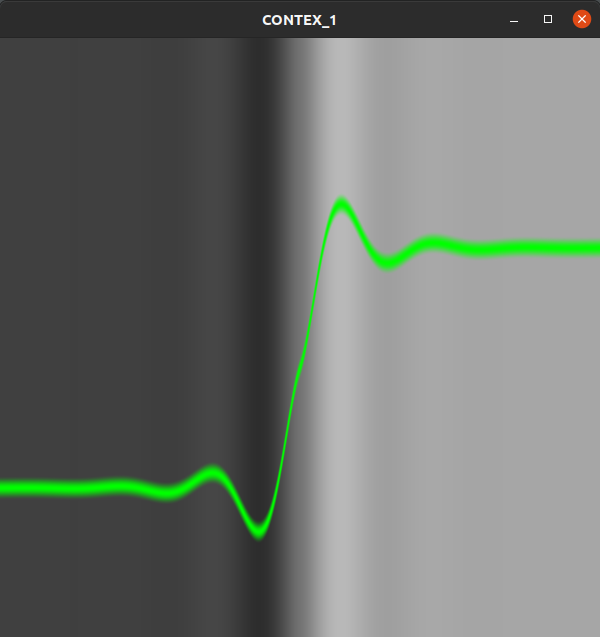

# MyUtilityForTheBookOfShaderEShaderToy
My Utility for learn OpenGl stuff with https://thebookofshaders.com/ and https://www.shadertoy.com/
--------
You can add fragment shaders in the folder shader, when the program start load all shaders and you can switch with + and -

//TO DO dinammic loading shaders 

